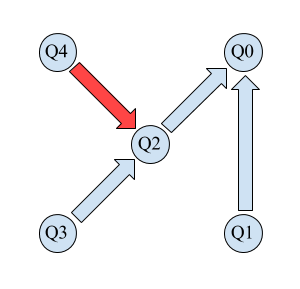

# IBMQX Experiments
The purpose of this repository is to demonstrate entanglement assisted invariance,
also known as envariance, and parity learning by querying a uniform quantum example oracle,
using IBM QX series quantum computers.

## Requirements

In order to run the experiments or just work with this repository you'll need to setup
the QISKit sdk, detailed instructions cn be found
[here](https://github.com/QISKit/qiskit-sdk-py/blob/master/doc/install.rst#3.1-Setup-the-environment).

You'll also need to register on [IBM Quantum Experience](https://quantumexperience.ng.bluemix.net/qx/community)
in order to receive your API Token (a key to grant you access to IBM QX quantum computers)
and have at least 5 credits on that account.

## Utility

The core of the problem is to find the qubit that is most connected;
by most connected we mean that it can be connected (directly or not) by means of cnot gates
to as many other qubits as possible.

[utility.py](https://github.com/DavideFrr/ibmqx_experiments/blob/master/utility.py)
contains all the functions needed to find the most connected qubit, given coupling-map,
and than proceed to create the circuits for envariance demonstration and parity learning respectivly.

We have designed an algorithm that, given the map and the number of qubits to be used in the experiment,
finds the most connected qubit and start building the GHZ circuit from that qubit. By most connected,
we mean that the qubit can be reached by as many other qubits as possible
through directed paths in the coupling map.

The objective is to assign every node _x_ a rank, defined as the number of nodes
that can reach _x_ along the directed edges of the coupling map.
The node with the highest rank is then selected as the starting point for building the circuit.

All of the above is done by the [explore()](https://github.com/DavideFrr/ibmqx_experiments/blob/c833012d024cae1ddff7849a5ce2d1fddcb93d0f/utility.py#L51),
whose objective is to assign a rank (the counter incremented when a node is reached) to
every node based on how many nodes can reach it. The node with the higher rank will be
selected as the start point for building our circuit.

As soon as the most connected qubit has been found, the [create_path()](https://github.com/DavideFrr/ibmqx_experiments/blob/c833012d024cae1ddff7849a5ce2d1fddcb93d0f/utility.py#L93)
function is executed, in order to obtain a path connecting all the qubits
that must be involved in the GHZ circuit.

The [place_cx()](https://github.com/DavideFrr/ibmqx_experiments/blob/bf9b5f02a8f7566aa09397f3e151dfa71b35d6c2/utility.py#L130)
function walks the aforementioned path and uses the [cx()](https://github.com/DavideFrr/ibmqx_experiments/blob/bf9b5f02a8f7566aa09397f3e151dfa71b35d6c2/utility.py#L114)
function to put across each node pair either a CNOT or an inverse-CNOT gate,
depending on the direction of the link dictated by the coupling map.
Parameter _k_ in [place_cx()](https://github.com/DavideFrr/ibmqx_experiments/blob/bf9b5f02a8f7566aa09397f3e151dfa71b35d6c2/utility.py#L130)
allows to reuse the function to build other circuits
than GHZ. More specifically, _k=11_ corresponds to the GHZ circuit.

Before launching an experiment on a specific device, you'll have to create a new [Utility()](https://github.com/DavideFrr/ibmqx_experiments/blob/bf9b5f02a8f7566aa09397f3e151dfa71b35d6c2/utility.py#L18)
object, the constructor takes the device coupling-map as a parameter;
when you're done experimenting with that device you'll
then need to [close()](https://github.com/DavideFrr/ibmqx_experiments/blob/bf9b5f02a8f7566aa09397f3e151dfa71b35d6c2/utility.py#L44)
the Utility object.

_ibmqx5 coupling-map graphic rapresentation_:
# 

_coupling-map python rapresentation_:
```python
coupling_map_qx5 = {
    0: [],
    1: [0, 2],
    2: [3],
    3: [4, 14],
    4: [],
    5: [4],
    6: [5, 7, 11],
    7: [10],
    8: [7],
    9: [8, 10],
    10: [],
    11: [10],
    12: [5, 11, 13],
    13: [4, 14],
    14: [],
    15: [0, 2, 14],
}
```


_Couplings between qubits in the resulting circuits, for QX4 and QX5 respectively:_
# 
_Red arrows means the use of inverse cnot_

## Envariance

[envariance.py](https://github.com/DavideFrr/ibmqx_experiments/blob/master/envariance.py)
is were you'll find all you need to tun envariance experiments; the [launch_exp()](https://github.com/DavideFrr/ibmqx_experiments/blob/ae9febb703fcb17b767528f7100557eb39d653e3/envariance.py#L60)
function will run the circuit for the given number of qubit, shots and coupling-map on the given
device.

After obtaining the GHZ state, envariance can be experimented by performing a swap,
using Pauli-X gates, on the first

and after that another swap to the remaining

qubits.

All results of the executions will be stored in txt files for later use.
More info in the code.

# 
# 
_Envariance circuits with 5 qubits and 16 qubits, on QX4 and QX5 respectively_

## Fidelity

You can use [fidelity.py](https://github.com/DavideFrr/ibmqx_experiments/blob/master/fidelity.py)
to estimate the classical fidelity of every execution and average them together. It is also possibile to
use [envariance_values_base2.py](https://github.com/DavideFrr/ibmqx_experiments/blob/master/envariance_values_base2.py)
and [envariance_values_base10.py](https://github.com/DavideFrr/ibmqx_experiments/blob/master/envariance_values_base10.py)
to se an overall distribution of
all the strings values measured during all executions (encoded in base 2 and 10 respectively).

## Parity

[parity.py](https://github.com/DavideFrr/ibmqx_experiments/blob/master/parity.py)
will run parity learning experiments; the [launch_exp()](https://github.com/DavideFrr/ibmqx_experiments/blob/ae9febb703fcb17b767528f7100557eb39d653e3/parity.py#L60)
function will run the circuit for the given number of qubit, queries, coupling-map and _k_;
_k_ can either be '11', '10' or '00' and represent the type of string that will be learned
by the oracle.

All results of the executions will be stored in txt files for later use.
More info in the code.

# 
# 
# 
_Parity circuits with 15 qubits on QX5, for k='00', k='10' and k='11' respectively_

## Bit-Wise Error

For the parity learning experiment, provided the noise isn’t too large,
each bit of the output is still correct more than half the time. What we do is:
- select only the results where the result qubit is 1
- keep track of the results for each bit separately
- use whichever result (0 or 1) is most common for each bit
(in case they are equal, select randomly)

Every time the resulting string is correct we have a success, dividing
the number of successes by the number of executions we obtain the success probability
and also the error probability.

All of ti can be done by running [bit_wise_error.py](https://github.com/DavideFrr/ibmqx_experiments/blob/master/bit_wise_error.py),
which will store the results in a txt file.
