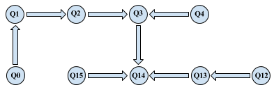

# IBMQX Experiments
The purpose of this repository is to demonstrate entanglement assisted invariance,
also known as envariance, and parity learning,
using IBM QX series quantum computers.

Here you will find not only the code needed to run the experiments yourself,
but also the results of ours
(in case you don't have the time or patience and just want to see the data).

## Requirements

In order to run the experiments or just work with this repository you'll need to setup
the QISKit sdk, detailed instructions cn be found
[here](https://github.com/QISKit/qiskit-sdk-py/blob/master/doc/install.rst#3.1-Setup-the-environment).

You'll also need to register on [IBM Quantum Experience](https://quantumexperience.ng.bluemix.net/qx/community)
in order to receive your API Token (a key to grant you access to IBM QX quantum computers)
and have at least 5 credits on that account.

## Utility

[utility.py](https://github.com/DavideFrr/ibmqx_experiments/blob/master/utility.py)
contains all the functions needed to find the most connected qubit, given coupling-map,
and than proceed to create the circuits for envariance demonstration and parity learning respectivly.

As already mentioned, the core of the problem is to find the qubit that is most connected;
by most connected we mean that it can be connected (directly or not) by means of cnot gates
to as many other qubits as possible. This is done in two main phases: first we invert all the connection
in the coupling map and than we explore all the possible paths from one qubit to another. The most connected
is the one with the most number of paths to different qubits.

_ibmqx3 coupling-map graphic rapresentation_:
# 

_coupling-map python rapresentation_:
```python
coupling_map_16 = {
    0: [1],
    1: [2],    2: [3],
    3: [14],
    4: [3, 5],
    5: [],
    6: [7, 11],
    7: [10],
    8: [7],
    9: [8, 10],
    10: [],
    11: [10],
    12: [5, 11, 13],
    13: [4, 14],
    14: [],
    15: [0, 14],
}
```


Below the portion of the coupling-map selected by utility.py:
# 

## Envariance

... ...

## Parity

... ...
